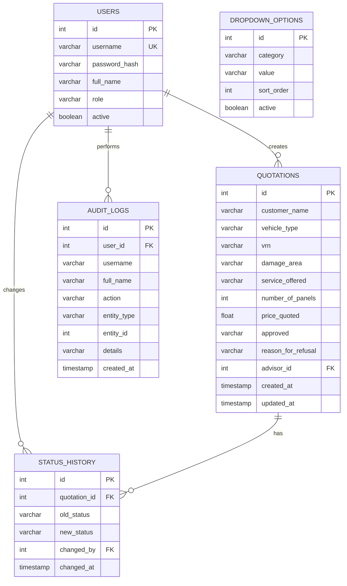

# Entity Relationship Diagram

```mermaid
erDiagram
    USERS ||--o{ QUOTATIONS : creates
    USERS ||--o{ STATUS_HISTORY : changes
    USERS ||--o{ AUDIT_LOGS : performs
    QUOTATIONS ||--o{ STATUS_HISTORY : has

    USERS {
        int id PK
        varchar username UK
        varchar password_hash
        varchar full_name
        varchar role
        boolean active
    }
    QUOTATIONS {
        int id PK
        varchar customer_name
        varchar vehicle_type
        varchar vrn
        varchar damage_area
        varchar service_offered
        int number_of_panels
        float price_quoted
        varchar approved
        varchar reason_for_refusal
        int advisor_id FK
        timestamp created_at
        timestamp updated_at
    }
    STATUS_HISTORY {
        int id PK
        int quotation_id FK
        varchar old_status
        varchar new_status
        int changed_by FK
        timestamp changed_at
    }
    AUDIT_LOGS {
        int id PK
        int user_id FK
        varchar username
        varchar full_name
        varchar action
        varchar entity_type
        int entity_id
        varchar details
        timestamp created_at
    }
    DROPDOWN_OPTIONS {
        int id PK
        varchar category
        varchar value
        int sort_order
        boolean active
    }
```

## Historical Rule
Do not delete advisors that already own quotations. Disable their login instead so historical advisor reporting remains correct.